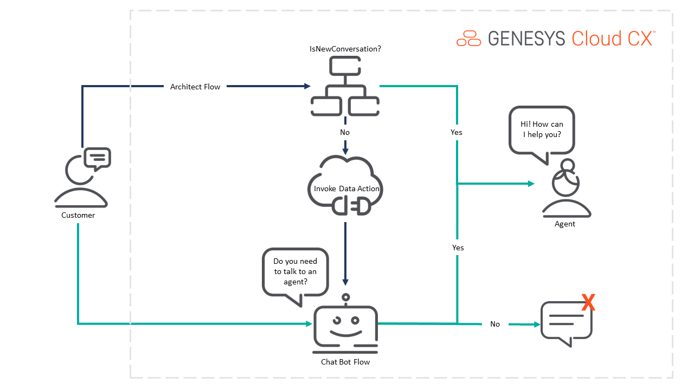

# Build a web messaging triage bot

> View the [Genesys Cloud Web Messaging Triage Bot Blueprint](https://developer.mypurecloud.com/blueprints/web-messaging-triage-bot-blueprint/ "Goes to the Web Messaging Triage Bot Blueprint") in the Genesys Cloud Developer Center.

This Genesys Cloud Developer Blueprint provides instructions for building a web messaging triage bot. The messaging bot triages the end of the conversation to check if it has been resolved and asks customers if they still want to speak to an agent. You can deploy all the solution components of the blueprint with the Terraform Genesys Cloud CX as Code provider.

You can view the complete blueprint and download the sample files from [here](https://github.com/GenesysCloudBlueprints/web-messaging-triage-bot-blueprint "Goes to the Web Messaging Triage Bot Blueprint").

