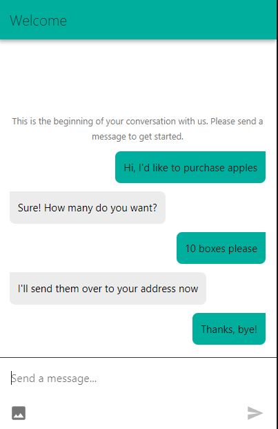
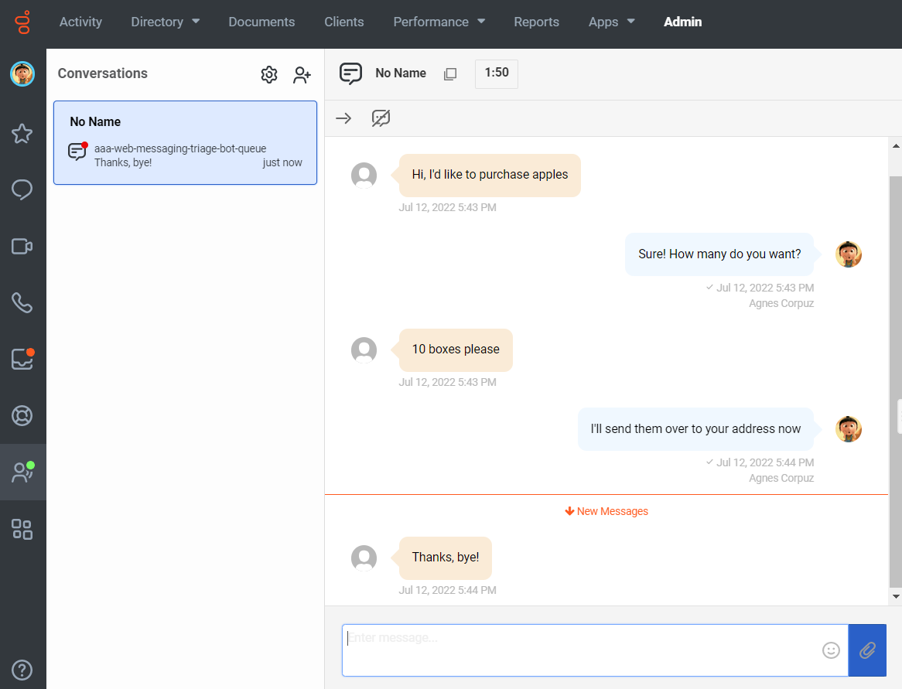
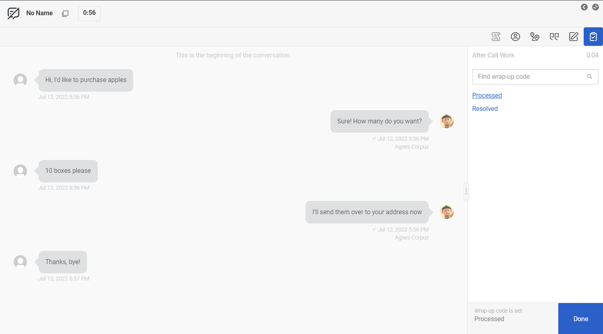
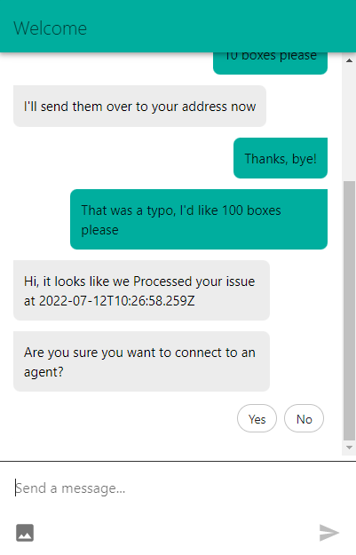
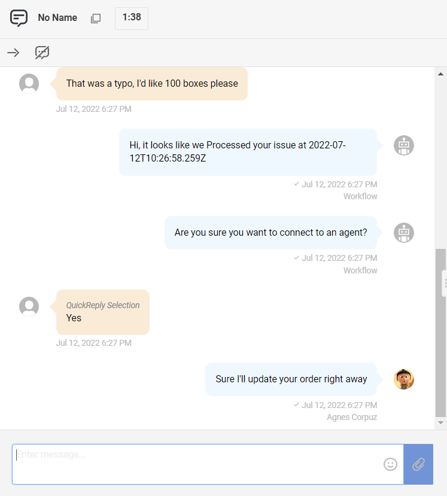
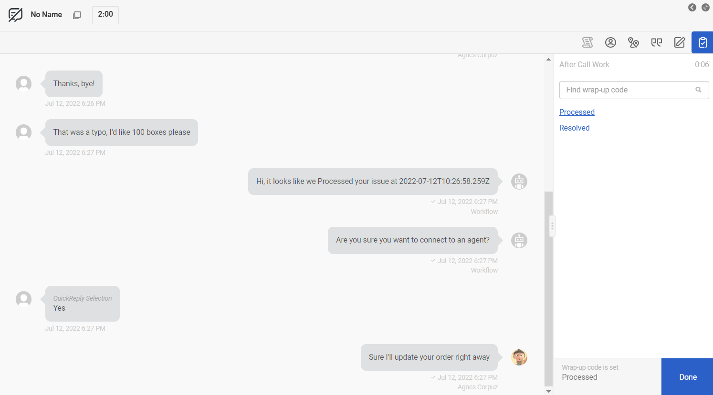
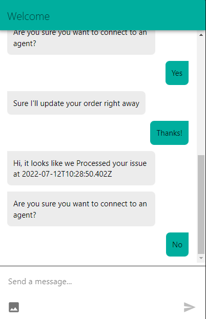

:::{"alert":"primary","title":"About Genesys Cloud Blueprints","autoCollapse":false} 
Genesys Cloud blueprints were built to help you jump-start building an application or integrating with a third-party partner. 
Blueprints are meant to outline how to build and deploy your solutions, not a production-ready turn-key solution.
 
For more details on Genesys Cloud blueprint support and practices 
please see our Genesys Cloud blueprint [FAQ](https://developer.genesys.cloud/blueprints/faq)sheet.
:::

This Genesys Cloud Developer Blueprint provides instructions for building a web messaging triage bot. The messaging bot triage the end of the conversation to see if the conversation has been resolved and asks customers if they still want to speak to an agent. You can deploy all the components used in this solution with the Terraform Genesys Cloud CX as Code provider.


## Scenario

An organization wants to filter incoming messages to see if the conversation has been resolved and asks customers if they still want to speak to an agent:

1. **The customer sends a message.** The agent receives the customer's incoming message and resolve or process their request.

2. **The agent ends the interaction.** The customer's concern has been resolved or prrocessed. 

3. **The customer sends another message.** The customer receives a message that their concern has been resolved or processed and bot flow asks if the customer wants to speak to an agent.
   
4. **The customer selects yes  or no.** The customer will be connected to an agent if they responds Yes. Otherwise the message will not be sent to the agent.

## Solution components

* **Genesys Cloud CX** - A suite of Genesys Cloud services for enterprise-grade communications, collaboration, and contact center management. In this solution, you use an Architect inbound message flow, a Genesys Cloud integration, a Genesys Cloud queue, web messaging configuration, and web messaging deployment.
* **Architect flows** - A flow in Architect, a drag and drop web-based design tool, dictates how Genesys Cloud handles inbound or outbound interactions.  In this solution, an inbound message flow provides the routing layer that gets the customer to the right queue.
* **Genesys Dialog Engine Bot Flows** - Build bots within Architect and then integrate them into Architect call, chat, and message flows. This process unifies the bot and flow authoring experience for administrators, flow authors, and contact center managers.
* **Web messaging and Messenger** - The Genesys Cloud messaging platform that enables asynchronous conversations and a unified agent and supervisor experience across all Genesys Cloud messaging channels. Messenger is the predefined message window that customers use to communicate with bots and agents. 
* **CX as Code** - A Genesys Cloud Terraform provider that provides an interface for declaring core Genesys Cloud objects.

## Prerequisites

### Specialized knowledge

* Administrator-level knowledge of Genesys Cloud
* Experience with Terraform

### Genesys Cloud account

* A Genesys Cloud license. For more information, see [Genesys Cloud Pricing](https://www.genesys.com/pricing "Opens the Genesys Cloud pricing page") in the Genesys website.
* The Master Admin role. For more information, see [Roles and permissions overview](https://help.mypurecloud.com/?p=24360 "Opens the Roles and permissions overview article") in the Genesys Cloud Resource Center.
* CX as Code. For more information, see [CX as Code](https://developer.genesys.cloud/devapps/cx-as-code/ "Goes to the CX as Code page") in the Genesys Cloud Developer Center.

### Development tools running in your local environment

* Terraform (the latest binary). For more information, see [Download Terraform](https://www.terraform.io/downloads.html "Goes to the Download Terraform page") on the Terraform website.

## Implementation steps

### Download the repository containing the project files

1. Clone the [web-messaging-triage-bot-blueprint repository](https://github.com/GenesysCloudBlueprints/web-messaging-triage-bot-blueprint "Opens the web-messaging-triage-bot-blueprintv repository in GitHub").

### Set up Genesys Cloud

1. To run this project using the Terraform provider, open a Terminal window and set the following environment variables:

 * `GENESYSCLOUD_OAUTHCLIENT_ID` - This variable is the Genesys Cloud client credential grant Id that CX as Code executes against. 
 * `GENESYSCLOUD_OAUTHCLIENT_SECRET` - This variable is the Genesys Cloud client credential secret that CX as Code executes against. 
 * `GENESYSCLOUD_REGION` - This variable is the Genesys Cloud region in your organization.

2. Run Terraform in the folder where you set the environment variables. 

### Configure your Terraform build

In the **blueprint/terraform/dev.auto.tfvars** file, set the following values, which are specific to your Genesys Cloud organization:

* `client_id` - The value of your OAuth Client ID using Client Credentials to be used for the data action integration.
* `client_secret`- The value of your OAuth Client secret using Client Credentials to be used for the data action integration.
* `email` - This value is the email account that you use with Genesys Cloud. It will be used to assign you to the appropriate Genesys Cloud queue.

The following is an example of the dev.auto.tfvars file.

```
client_id       = "your-client-id"
client_secret   = "your-client-secret"
email           = "test-email@company.com"
```

### Run Terraform

You are now ready to run this blueprint solution for your organization. 

1. Change to the **/terraform** folder and issue these commands:

* `terraform init` - This command initializes a working directory containing Terraform configuration files.
  
* `terraform plan` - This command executes a trial run against your Genesys Cloud organization and shows you a list of all the Genesys Cloud resources it creates. Review this list and make sure that you are comfortable with the plan before continuing to the second step.

* `terraform apply --auto-approve` - This command creates and deploys the necessary objects in your Genesys Cloud account. The --auto-approve flag completes the required approval step before the command creates the objects.

After the `terraform apply --auto-approve` command completes, you should see the output of the entire run along with the number of objects successfully created by Terraform. Keep these points in mind:

*  This project assumes you are running using a local Terraform backing state, which means that the `tfstate` files are created in the same folder where you run the project. Terraform does not recommend using local Terraform backing state files unless you run from a desktop and are comfortable with the deleted files.

* As long as you keep your local Terraform backing state projects, you can tear down this blueprint solution by changing to the `docs/terraform` folder and issuing a `terraform destroy --auto-approve` command. This command destroys all objects currently managed by the local Terraform backing state.

### Deploy the snippet to your website

After you have created the Genesys Cloud objects, use a Messenger deployment to add a Messenger chat window to your website.

1. Navigate to **Admin** > **Message** > **Messenger Deployments** > **web-messaging-triage-bot-deployment**.
2. Under **Deploy your snippet**, click **Copy to Clipboard** to copy the snippet. Paste the snippet in the `<head>` tag of the web pages where you want the Messenger to appear.

### Test the solution

1. Go to your website and start a web message.
   
2. To answer the message as an agent, in your Genesys Cloud organization change your status to **On Queue** and answer the incoming interaction.
3. Interact with the customer by sending responses as an agent.
   
4. End the interaction with the customer and select a wrap-up code.
   
5. As a customer, send another message. Select Yes from the quick response to be connected again to an agent.
   
6. As an agent, answer the interaction and resume your conversation with the customer.
   
7. As an agent, end the interaction and select a wrap-up code.
   
8. As a customer, send another message and select No from the quick response.
   
9. The last customer's message will not be routed to ACD and agent.

## Additional resources

* [About web messaging](https://help.mypurecloud.com/articles/about-web-messaging/ "Opens the About Web Messaging page")
* [About the Genesys Cloud data action integrations](https://help.mypurecloud.com/articles/about-the-data-actions-integrations/ "Opens the About the Genesys Cloud data action integrations page")
* [About Genesys Dialog Engine Bot Flows](https://help.mypurecloud.com/articles/about-architect-dialog-engine-bot-flows/ "Opens the About Genesys Dialog Engine Bot Flows page")
* [web-messaging-triage-bot-blueprint repository](https://github.com/GenesysCloudBlueprints/web-messaging-triage-bot-blueprint "Opens the web-messaging-triage-bot-blueprint repository in GitHub") 
